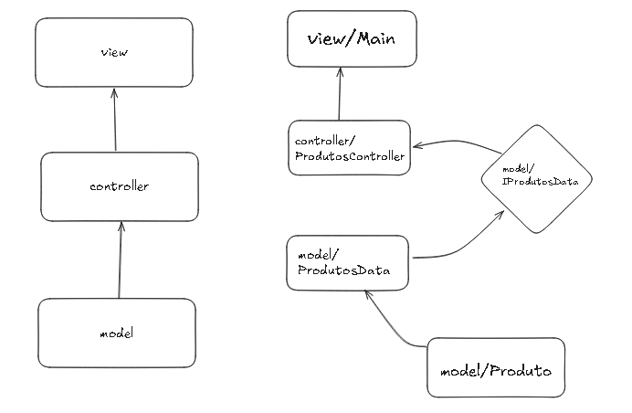

# 🛒 Sistema de Cadastro e Gerenciamento de Produtos

## 📋 Descrição

Este projeto é um sistema simples, porém robusto, para **cadastro e gerenciamento de produtos** em uma loja virtual, desenvolvido em Java seguindo a arquitetura em três camadas (MVC). A interação é feita via **terminal/console**, proporcionando uma experiência direta e didática.

---

## ✨ Funcionalidades

- ➕ **Cadastro de Produtos:** Insere produtos com código, nome e preço, evitando códigos duplicados.
- 🔍 **Consulta:** Pesquisa e exibe detalhes do produto pelo código.
- ✏️ **Atualização:** Edita nome e preço de produtos já cadastrados.
- ❌ **Exclusão:** Remove produtos mediante confirmação do usuário.
- 📋 **Listagem:** Exibe todos os produtos cadastrados e a quantidade total.
- ✔️ **Validações:** Garante campos obrigatórios preenchidos e preços válidos.
- 🚫 **Tratamento de Erros:** Exceções personalizadas para mensagens claras e específicas.

---

## 📂 Estrutura do Projeto

```
├── controller
│   └── ProdutosController.java
├── model
│   ├── Produto.java
│   ├── IProdutosData.java
│   └── ProdutosData.java
├── view
│   └── Main.java
└── exception
    └── (exceções personalizadas)
```

---

## 🏗️ Arquitetura do Sistema

O sistema está dividido em camadas para facilitar manutenção e organização:

- 👁️ **Camada de Apresentação (View):** Interface com o usuário, menus e captura de dados via terminal.
- ⚙️ **Camada de Controle (Controller):** Aplica as validações, regras de negócio e manipulação dos dados através de inversão de dependência, isto é, depende da implementação da interface.
- 💾 **Camada de Dados (Model):** Contém Estrutura da regra de negócio e armazenamento dos produtos em memória (array).

---

### 📌 Diagrama de Arquitetura

Aqui está a arquitetura do projeto baseada no padrão MVC e aplicando os princípios SOLID:



---

## 🚀 Como Executar

1. Compile todos os arquivos `.java` das pastas `model`, `controller`, `view` e `exception`.
2. Execute a classe principal:  
   ```bash
   java view.Main
   ```
3. Siga as instruções no terminal para navegar e utilizar o sistema.

---

## 🛠️ Tecnologias Utilizadas

- Java 11 (ou superior)
- Execução via terminal (console)

---

## ⚠️ Exceções Personalizadas

- `LimiteProdutosException` — Limite máximo de produtos atingido.
- `ProdutoInexistenteException` — Produto não encontrado para consulta/manipulação.
- `ProdutoRepetidoException` — Código de produto já cadastrado.
- `OpcaoInvalidaException` — Opção inválida no menu.
- `PrecoInvalidoException` — Preço inválido ou negativo.

---

## 📬 Contato

Dúvidas, sugestões ou feedback? Fique à vontade para entrar em contato! ✉️

---

© 2025 Sistema de Cadastro de Produtos — Desenvolvido por Claudio Azevedo